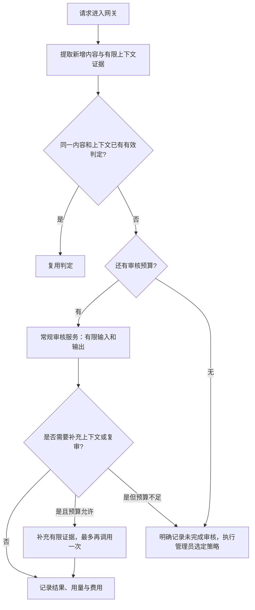

# 多服务商内容审核：质量与成本设计提案

状态：2026-09-22 第一阶段已实现于本地代码：多服务路由、数据库预算账本、用量、完整判定缓存和管理面板；尚未发布镜像。有限上下文、分段和复审仍为后续设计。以下全文是目标方案，具体已实现范围与差异见 CUSTOMIZATION.md 的“多服务审核与预算”。配置示例与静态原型不是当前 API 导入文件。

## 设计交付

- [可点击原型](designs/moderation-console.html)：四个设置页、服务编辑、预算测算、异常场景推演。无需真实 Key，不访问外部服务。
- [配置结构示例](designs/moderation-config-v2.example.json)：字段设计参考，不能导入当前 v0.2.7-fix1。
- 原型使用现有柔和紫色：背景 `#f8f7fb`、表面 `#ffffff`、正文 `#231d2c`、次要正文 `#675d75`、边框 `#e5e1ee`、主色 `#6e52a3`；沿用系统字体。以服务列表、表单和判定路径表达信息，不改变现有侧边栏和全站导航。
- 设计检查：与现有后台一致，减少必填项，把代码与供应商特殊参数留在高级设置；费用没有数据时显示未知，演示数据明确标记。

## 已核实的现状

- `content_moderation_input.go` 通常只提取请求末尾的用户输入，不会把整段 messages 全部发给审核模型；纯工具结果或 assistant 续接通常不送审。Responses 的字符串 input 被视为一个整体输入。
- `ContentModerationInput.Normalize` 最多保留 12,000 个 Unicode 字符。这是字符限制，不是 token 或费用限制；审核系统提示词、图片和模型输出另计。
- 现有缓存记录已命中的输入哈希，不是带策略版本、上下文隔离、TTL 的完整判定缓存，也不复用正常结果。
- OpenAI Compatible 配置只有一套 Base URL / 模型与多个 Key；这些 Key 共用同一模型和地址。当前无法同时配置 A、B 两家通用审核服务并分别定价、限额、校准。
- 自定义聊天解析未记录 usage；默认 payload 没有显式输出 token 上限。重试也没有独立费用预算。
- 业务模型供应商与审核供应商是两回事。审核策略应在统一网关入口执行，不因业务模型换到另一家而重复计费或变换策略。

## 建议的处理流程



## 1. 审核服务配置与路由

把一个审核地址扩展为多条独立的“审核服务”配置，每条拥有稳定 ID：

- 名称、启用状态、接口类型、Base URL、模型 ID、独立 Key 池、代理。
- 用途：常规审核 / 深度复审 / 故障备用；优先级和可选的同档权重。
- 输入预算、输出上限、请求超时、并发、每日 token 与费用额度。
- 计费币种，以及输入未命中缓存、输入缓存命中、输出的单价；支持按次收费等附加项。不按模型名字推断运营商价格。
- 经过验证的能力：文本、图片、JSON 约束、输出限制参数、可否关闭推理、是否返回 usage。只发送该服务实际支持的参数。
- 该服务的阈值与校准记录；不同模型不能因字段都叫 confidence 就共用未验证的数值阈值。

初始从已有设置派生“现有审核服务”，保留原 Key、模型、提示词与策略，不自动启用其他厂商。后台可添加第二家独立服务。业务模型的运营商变化不要求复制这些审核配置。

常规请求只调用一个服务，不对所有供应商并行群发。优先使用已验证合格的常规服务；仅错误或显式配置的复审需要时切换。供应商切换不得绕过总调用预算，备用也不得自动选用未经授权的更贵模型。遇到明确 4xx 配置错误不循环重试；429/5xx 等按服务健康状态处理。

## 2. 以新增内容为主，保留少量上下文

- 常规审核检查本次新增用户输入，加上解释当前意图确实需要的有限前文或服务端维护的证据摘要。
- 不重复发送完整代码库、历史文档和已经处理过的工具日志。
- 对“继续做上一步”等依赖上下文的请求，不能只检查这几个字；补充先前目标、操作对象、授权声明的来源与相关原文片段。
- 摘要不是默认再调用一次大模型生成。优先使用结构化证据、有限原文和复用已有处理结果；任何模型摘要调用也计入预算。
- 证据摘要属于不可信内容，不能充当新的系统指令；用户自称“已审核/已授权”的文本不等于服务端验证结论。
- 有新目标、新指令或改变意图的工具续接需要重新评估；不能把“工具消息”或客户端自带的提示标签作为可信免审凭证。
- 会话状态须隔离租户、API Key、会话及分支；客户端 conversation_id 单独不足以复用另一个会话的安全结论。无可靠会话标识时，只用请求中可验证的有限前文，不拼接该 Key 的其他对话。

质量限制：有限上下文不可能完全等价于全上下文审核。对覆盖不充分的输入明确记录“部分审核/待复审”，避免把缺少证据当成低风险。

## 3. 长输入与输出预算

设置“本次所有审核调用的总预算”，包括审核系统提示词、当前文字、选取的上下文、图片、输出和重试，不能只限制用户文字。

可供试运行讨论的起点（待真实流量和预算校准，不自动写入线上）：

| 项目 | 起点 | 说明 |
| --- | --- | --- |
| 常规审核总输入 | 4,096 tokens | 包含系统提示词及全部选取证据 |
| 复审总输入 | 8,192 tokens | 只对需要更多证据的请求使用 |
| 单次输出 | 256–512 tokens | 简短 JSON；根据模型是否存在推理开销验证 |
| 单个业务请求的审核调用 | 最多 2 次 | 首审、复审、故障重试共享此上限 |
| 完整判定缓存 TTL | 15 分钟起测 | 根据策略变化和实际重复率调整 |

长文本先在本地识别消息边界、结构和风险线索，选取开头、结尾、相关片段及必要邻近上下文。没有关键词不能据此自动放行。切分或摘要会损失信息，必须记录覆盖范围；超预算不能无限拆块调用。

内容超限且无法得到足够证据时，按明确配置选择：受限复审、要求缩短请求/暂时拒绝、或记录部分审核并放行。严格程度是产品策略，不能在此次改造中暗自决定。

token 计数应使用模型适配的计数器；不支持精确计数时显示保守估算，并另外设置请求字节、图片数量/尺寸与调用次数上限。即使只有一张图片，也不代表文字 token 上限覆盖了图片费用。

输出上限按服务能力映射；支持关闭推理且效果达标的模型可配置非推理模式。截断 JSON、缺失判定或被拒答不能当成合规结果，必须进入未完成审核路径。

自定义 payload 仍属于高级功能，但最终请求必须经过预算校验；不能靠脚本自行覆盖输出上限、增加多路 choices 或扩大上下文绕过成本限制。

## 4. 判定缓存与前缀缓存分开处理

### 网关判定缓存

相同审核输入、相同上下文和相同策略下，直接复用有效的原始判定，省掉一次模型调用；合规与违规结果都可缓存。并发相同请求使用 singleflight 避免重复调用。

缓存键至少隔离租户/用户作用域、完整输入哈希、被选上下文摘要与覆盖范围、策略与 payload 版本、审核服务/模型配置版本及阈值版本。原文哈希要在截断前计算，避免不同长文共享相同前缀而误复用。

只缓存成功、完整覆盖且结构合法的结论；异常、超时或未完成审核不得写成合规缓存。变更规则/模型/阈值后旧结论失效。同一业务请求的重试或事件重放不得重复发送邮件、重复计违规；不同业务请求即使命中同一缓存，仍按现有规则统计。审计事件计数和模型调用计费分开。

### 供应商前缀缓存

将稳定的审核系统提示词放在请求开头，可以尝试使用支持该功能的供应商缓存。但缓存命中仍可能计费，且不同供应商、不同账号或路由不保证共用缓存。通过实际 usage 统计命中率，不把缓存折扣当作预算前提。

参考：[DeepSeek 官方上下文缓存说明](https://api-docs.deepseek.com/guides/kv_cache/)。官方说明提供命中/未命中用量字段，且命中属于 best effort；其他运营商是否兼容需要单独验证。

## 5. 用量统计、额度与预算耗尽行为

记录每次首审、复审、重试的服务、模型、输入/缓存/输出/推理 token（避免与输出重复计费）、延迟、实际发送次数、usage 来源以及估算费用。供应商未提供 usage 时标记“估算/未知”，不能显示零成本。

按服务、用户/Key、分组和全站分别统计。试跑同样会消耗额度，须纳入统计。并发请求在调用前原子预留预算，返回后按 usage 结算；超时等计费不确定的尝试保留预留额，不能直接当作零费用释放。

日成本计算基于各供应商实际价格：

`费用 = Σ[(未缓存输入 token × 对应单价 + 缓存输入 token × 对应单价 + 输出 token × 对应单价) / 1,000,000 + 其他计费项]`

设置预算告警、token 硬限额和调用数硬限额；货币额度以已验证价格及最大请求预算做保守预留。在供应商单价不明、计数不准或仍有在途请求时，不能声称本地统计绝对保证外部账单不超额，应同时使用供应商账户额度/余额限制。

预算达到上限后停止新的付费审核调用；后台明确选择“临时拒绝待审请求”还是“记录未审核并放行”。未审核不等于模型判定违规，不计入违规自动封禁；也不能显示为“审核通过”。默认保留旧版本行为，新的预算耗尽策略需显式配置。

## 6. 如何衡量质量与节省

使用用户实际业务中的标注样本和预期规则对比：正常开发/自有系统运维、第三方逆向请求、授权测试、模糊表达、多轮省略、新增工具指令、长输入中间/末尾风险片段。

逐项统计漏判、误判、部分审核率、复审比例、重复判定命中率、实际输入/输出 token、每千业务请求成本与 P95 延迟。各供应商分别校准；不把模型自己报告的 confidence 当成经过统计校准的准确率。

先用离线或明确设限的小流量测试验证方案，再启用新路由。不能为省钱默认只审核 10% 请求；优先减少重复付费、无关历史和长输出，同时保留新用户输入的审核覆盖。

## 分阶段实施

1. 第一阶段：多服务商配置、usage/价格统计、输入输出预算、总调用上限、明确预算耗尽策略、版本隔离的结果缓存。这些最容易测量实际收益。
2. 第二阶段：有限上下文证据、受控复审和长文本片段选择；先建立质量回归样本再启用，避免削弱多轮或长文本检测。
3. 保留小而独立的 fork 模块与测试，通过可选配置兼容旧 settings，便于以后继续合并官方代码。

待补的测量输入：每日请求量、实际审计调用次数、当前平均/P95 输入长度、重复率、供应商价格表、希望的每日/月度预算，以及“多运营商”指审核模型还是业务模型。

## 7. 后台交互规格

现有风险控制开关、审计范围、模式、关键词、通知、封禁与日志保留策略继续存在。此次设计只替换审核服务与自定义模型相关配置，并增加成本视图。

| 页面 | 主要信息 | 交互与校验 |
| --- | --- | --- |
| 审核服务 | 名称、用途、状态、模型、上限、近期用量 | 添加/编辑/停用；Key 只写入、掩码显示；新增默认停用，试跑不等于启用 |
| 审核策略 | 系统提示词、输入范围、token 上限、缓存、复审 | payload 默认留空；规则只编辑一次，服务阈值独立；打开复审前检查对应服务 |
| 预算与用量 | 全站/服务/分组/用户用量、预计与待结算费用 | 额度可空但不伪装成零；单位和时区明确；启用硬限额必须选择耗尽策略 |
| 试跑预览 | 送审片段、覆盖度、判定来源、路由、usage、费用 | 本地预览不调用；真实试跑按钮明确说明计费，使用草案但不保存策略 |

生产界面沿用现有布局与紫色主题，不再嵌套一套新的站点导航。原型的四页是新增功能的信息组织示意；现有范围、通知等标签仍保留。手机上页签可横向滚动，表格局部横向滚动；表单单列，主操作保留可见焦点。金额测算不需要连接模型。

保存分为“保存配置”和“启用新策略”。保存时返回变更摘要：地址/模型变化、预算和异常处置变化、缓存是否失效。启用新策略是正常配置动作，不额外弹出笼统确认；如果缺少必选处置，直接在相关字段旁提示。

每日/月度金额未提供，字段初始为空；不预置真实费用。预算边界按后台选择的 IANA 时区计算，界面显示下次额度重置时间。原型使用 CNY 演示，实际服务可分别使用不同币种；没有有效换算价时不合并为一个虚假的总金额。

### 高级配置的边界

- 能力以服务配置和真实试跑验证为准，不按 `deepseek-flash` 名称推断运营商身份。
- 自定义 payload 生成请求后仍经过 `RequestLimiter`。输出数 `n` 固定为 1，流式审核不启用，最终消息和媒体必须接受预算计数。
- 供应商不支持可验证的输出上限或无法计算合理成本上界时，不允许加入“硬费用上限”路由；可以单独启用仅调用数/token 的限制，并显示费用上界未知。
- 不支持图片的服务不能把含图输入作为完整审核。可切换已配置的视觉审核服务或进入未完成审核策略。

## 8. 数据结构与模块边界

将 fork 代码集中在独立文件，保留一个小的网关接入点：

```text
ContentModerationService.Check
  ├─ legacy mode：现有流程
  └─ v2：PlanRequest → LookupVerdict → ReserveBudget → AuditAttempt
                     → optional second attempt → Finalize → RecordEvent

internal/service/content_moderation_v2/
  config + compatibility      配置快照、旧配置映射、校验
  provider                    接口能力与返回值适配
  input_plan                  提取范围、证据片段、覆盖度
  router                      主服务、备用和复审选择
  limiter                     最终请求预算检查
  verdict_cache               判定缓存与并发去重
  budget                      预留、结算和不确定费用
  evaluator                   阈值、复审规则与最终状态
```

上图目录名是职责示意；Go 依赖必须单向，不能让新包反向引用 service 大包再形成循环。实现时把共享接口/值类型放在不依赖业务 service 的小包，或先使用 `content_moderation_v2_*.go` 文件留在同一 package，避免为了目录结构增加重构。

### 核心配置对象

- `ModerationPolicyV2`：版本、启用状态、共享 prompt、模式、输入预算、路由、复审、缓存、全站预算、未完成审核策略。
- `AuditProvider`：稳定 ID、修订号、用途、接口类型、地址、模型、凭据引用、能力、阈值、限额、价格表与价格版本。
- `AuditPlan`：完整源输入摘要、选择的原文片段、证据来源、覆盖状态、预计输入/媒体成本；不信任客户端自带的“已审核”标志。
- `AuditAttempt`：唯一 attempt ID、所属业务 request ID、配置快照版本、服务、开始/结束时间、usage、账本预留与错误类别。
- `AuditVerdict`：`allow/block/unresolved`，`confidence/flagged` 来源、实际阈值、原因、覆盖度及证据指纹。
- `AuditEvent`：业务请求级最终事件，模型调用数、是否缓存、行为、费用状态；模型多次调用不能重复计违规事件。

配置继续存入现有 settings 的独立 v2 键，GET 返回脱敏视图。敏感凭据沿用现有安全存储机制，写入后只返回掩码；草案导出、日志和哈希诊断中不包含原始 Key。

用量新增持久账本，不能只塞进现有审计日志的临时统计：

- `content_moderation_attempts`：调用 ID 唯一，业务请求 ID、来源（网关/试跑）、provider_id、config_revision、状态、token、计费快照、费用预留与实际结算。
- `content_moderation_budget_buckets`：额度周期、作用域、币种、已结算与预留金额、调用数/token 数；作用域和周期唯一。
- 金额使用定点十进制，避免浮点累加。推理 token 属于 completion 总数的供应商，不重复加计。
- 不为成本账本保存完整用户原文或供应商原始 response。已有日志摘录规则继续适用。

## 9. 判定与故障状态机

以下为 v2 的审核判定语义；旧版仍使用兼容分支。最终网关行为继续受模式控制：`off` 不启动审核和付费调用；`observe` 记录审核结果但不因风险或额度问题拒绝原请求；`pre_block` 才按 block/unresolved 处置同步阻断。异步观察任务也计入预算。

| 条件 | 最终状态 / 下一步 | 是否按违规计数 |
| --- | --- | --- |
| 完整覆盖，confidence 达到该服务拦截阈值 | block | 按现有规则计一次 |
| 完整覆盖，confidence 未命中且不需复审 | allow | 否 |
| 完整覆盖，仅返回 flagged | 按布尔值判定；不伪造置信度 | 仅 true 时计一次 |
| 同时返回 confidence 与 flagged | 保持 confidence 优先，记录来源 | 依最终判定 |
| 需要上下文 / 命中已校准复审区间 | 预算内再调用一次已配置复审服务 | 暂不计数 |
| 复审完成且覆盖充分 | 使用复审服务的策略阈值得出最终结果，不平均分数 | 依最终判定 |
| 截断、空 JSON、拒答、未覆盖图片/长文 | unresolved | 否 |
| 429/5xx/超时 | 有余额和次数时尝试下一配置服务，否则 unresolved | 否 |
| 401/403/无效模型等配置错误 | 冻结/标记该服务，不在同一服务循环重试；有备用可切换 | 否 |
| 缓存中有有效完整判定 | 复用；计费调用数为 0 | 同一请求只处理一次事件 |
| 费用/次数超限，或严格预算存储不可用 | 停止付费调用，unresolved | 否 |

复审区间属于服务校准参数，不能直接把“0.5”写死为通用不确定性。缺少上下文和覆盖不全可独立触发复审；模型未提供 `needs_context` 时，也不把缺省当成“上下文充分”。

`unresolved` 按管理员明确选择执行：

- `reject_temporary`：建议 HTTP 503，稳定错误码 `content_moderation_unavailable`，原因细分 budget / unavailable / coverage；不能使用“违规”文案，也不自动封号。
- `allow_record`：允许业务请求并记录未完成审核；后台显著显示覆盖率下降，不冒充 allow verdict。

业务请求自身违反网关格式/体积限制时仍走现有 4xx 校验，不混用上述审核状态。

### 事件去重的准确语义

缓存只省模型费用，不让重复提交的违规业务请求永久免于计数：

- 同一个服务端 request ID 的重试、fallback、日志重放：最终违规只记一次。
- 不同 request ID 的用户重新提交：可以命中缓存节省费用，但仍是新的业务事件，按现有封禁策略统计。
- 不接受未经作用域校验的客户端 request ID 来跳过审计；API Key、用户和幂等键验证沿用网关规则。

## 10. 预算预留与并发正确性

第一阶段以 PostgreSQL 账本为权威，Redis 只用于缓存和快速状态，不以 Redis 单次扣减加异步数据库写入冒充可靠费用上限。

1. 构造最终审核请求并验证输入、输出和媒体限额，取得价格与配置快照。
2. 在一个事务中按固定顺序锁定本次涉及的全站、服务、用户/分组 budget bucket；检查 `settled + reserved + 本次最大预留 <= cap`，同时预留调用次数。
3. 生成唯一 attempt ID 并提交预留事务，然后才发送网络请求。预算预留失败时不发送模型请求。
4. 响应成功后按实际 usage 结算并释放差额；用 attempt ID 保证回调/重试结算幂等。
5. 超时或连接断开后供应商是否计费不明时，标记 `unknown_usage`，保留保守预留。只有有证据未发出请求才释放。
6. 请求跨午夜时仍结算到开始预留的 bucket。新 bucket 不得抹掉上一周期的未结算余额。

硬预算必须有可验证的最大费用预留；未校验的 token 估算只能作为统计。不能宣称能在供应商不返回 usage、价格变更或不遵守输出参数时保证最终外部账单绝对不超额。界面同时显示“已结算、待结算、估算未知”。

HTTP 生命周期结束不等于自动释放预算。进程崩溃后，后台恢复作业根据持久 attempts 标记未完成调用，不一律退款。上游没有幂等计费保证时不得假定网络重试免费。

## 11. 缓存边界、上下文与长文本

v2 结果缓存使用独立 Redis namespace，绝不把旧版全局 flagged hash 集合作为新完整判定的依据。TTL、策略版本、服务修订号与上下文证据一同参与键；新模型上线或修改规则自动失效。

完整原文摘要在任何截断/过滤前计算，结构化数据使用确定性序列化；不把不同字符内容粗暴折叠成同一“合规”缓存条目。图片 URL 内容可能变化，未取得可靠内容摘要时不复用含图完整判定；不因审核而任意抓取不可信 URL。

网关没有可靠会话标识时，第一阶段仅依据本次请求所带的有限前文。第二阶段的服务端证据状态必须验证租户/用户/Key/会话分支；不能按 IP 或 Key 把多个人、多会话拼接起来。借助 `previous_response_id` 的请求如果没有可取的前文，显示上下文不足。

本地关键词/结构识别仅帮助选择片段，不能证明未选部分安全。长文本如未覆盖本次需要审查的新内容，保守记为 partial/unresolved；管理员可以接受记录后放行这一取舍，但系统不得隐藏。深度复审仍有独立预算，不自动扫描无限长全文。

## 12. API、配置迁移和回滚

建议新增 API（路径最终跟随现有 router 命名风格）：

| 操作 | 行为 |
| --- | --- |
| GET /admin/risk-control/v2/config | 脱敏配置和 revision，含迁移状态 |
| PUT /admin/risk-control/v2/config | If-Match 乐观锁保存；字段校验，不隐式启用新供应商 |
| POST /admin/risk-control/v2/preview | 本地生成送审计划、覆盖范围和费用上界，不调用模型 |
| POST /admin/risk-control/v2/test | 管理员显式真实试跑，计入当前有效预算，返回草案 revision |
| GET /admin/risk-control/v2/usage | 各作用域的周期用量、费用与未知预留 |
| POST /admin/risk-control/v2/migrate | 从当前配置生成禁用的 v2 草案，保留旧配置原文 |

安全约束：真实试跑可用未保存的模型/prompt，但不能通过草案调高全站预算或重置账本；预算授权取当前保存配置。每次请求固定使用一个不可变配置快照，不能一半按旧价、一半按新阈值。

迁移步骤：

1. 升级二进制时 v2 默认关闭，兼容分支继续服务；不要只因读到新字段就切换行为。
2. 打开新设置时可生成“从现有配置导入”的草案；继承主服务、Key、prompt、threshold、模式与审计范围。默认不添加真实的第二家厂商。
3. 管理员配置服务、确认费用单位和未完成审核策略，真实试跑通过后显式启用 v2。
4. v2 启用期间旧设置写接口不得悄悄覆盖新服务：对重叠字段返回明确的版本冲突提示；不相关通知/保留期仍走共享配置。防止旧浏览器标签写回过时状态。
5. 支持切回保留的旧配置快照；仅停止新 v2 审核计划，不取消在途结算、不清空账本。审计/费用数据继续可读。
6. 数据库采用增量建表，不删除旧列；真正降级二进制前停用 v2 并等待在途请求完成。

## 13. 实施验收清单

- 两家审核服务分别使用自己的 URL、Key、模型和价格；切换业务模型不会重复触发首审。
- 未配置有效备用时明确未完成审核；无论重试与复审如何组合，总调用次数都不超上限。
- 一个长历史加一条短输入只发送选取内容；含省略语的请求保留必要前文；缺少上下文有独立状态。
- 风险信息在长文中间/末尾、图片未被支持、用户伪造已审核标记，都不能静默成为完整通过。
- 缓存相同内容节省一次真实调用；不同用户/上下文/规则版本不误命中；过期、并发去重与配置变更有测试。
- 100 个并发预算竞争请求只能在总预留额度内发出；超时、午夜、进程重启、usage 缺失和重复结算均有账本测试。
- `confidence` 与 `flagged` 显示正确；coverage 与 verdict 分开，不伪造 100% 置信度或完整审核。
- 保存和试跑使用的 revision 清楚；草案试跑不能提升已保存的预算额度。
- 表单新增/编辑/停用、键盘操作、手机与深色模式可用；已保存的 Key 不以明文回填页面，不出现在配置导出或日志中。
- 官方合并测试保留：legacy 默认行为不变；v2 开关迁移/回滚明确；新功能按既有 `v官方版本-fixN` 发布。

## 14. 交付顺序与未定项

- 可先编码：多服务商配置与适配、usage 规范化、输出/调用上限、账本与预算预留、缓存和清晰的结果状态。
- 随后编码：有限上下文方案、长文证据、受控复审；以真实标注样本做质量验收，不能只测接口能否返回。
- 业务金额与服务商价目未确定，因此配置保持可选并清楚显示未设置；不能编造节省比例。正式启用时必选未完成审核策略，不需要为制作本设计先确定费用。
- 仍保留此前已完成但未发布的设置体验修正。本设计没有提交远程、发布镜像或改动线上数据库。


## 原型验证记录

2026-09-22 已在本机浏览器验证：添加服务默认停用、主/备用/复审切换、每请求最多调用次数、缓存零调用、额度耗尽两类处置、未选处置提示、未知价格显示、复审与重试比例校验、费用公式、键盘页签和 390 px 手机布局。检查浅色与深色截图，页面无脚本错误。

费用公式测试使用明确的测试假设，不代表真实价格：每天 10,000 次业务请求、判定缓存 30%、首审输入 1,800/输出 80 token、复审比例 10%、复审输入 8,192/输出 120 token；首审输入/输出单价 1/2，复审输入/输出单价 3/4（CNY/百万 token），计算结果为每日 31.2592 CNY。改变参数会重新计算，价格留空显示未知。

浏览器测试只允许本机地址，未调用真实审核模型。该记录仅证明原型交互与测算逻辑，不证明真实审核准确率或上线后的预算控制能力。
